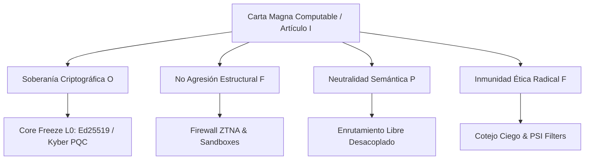
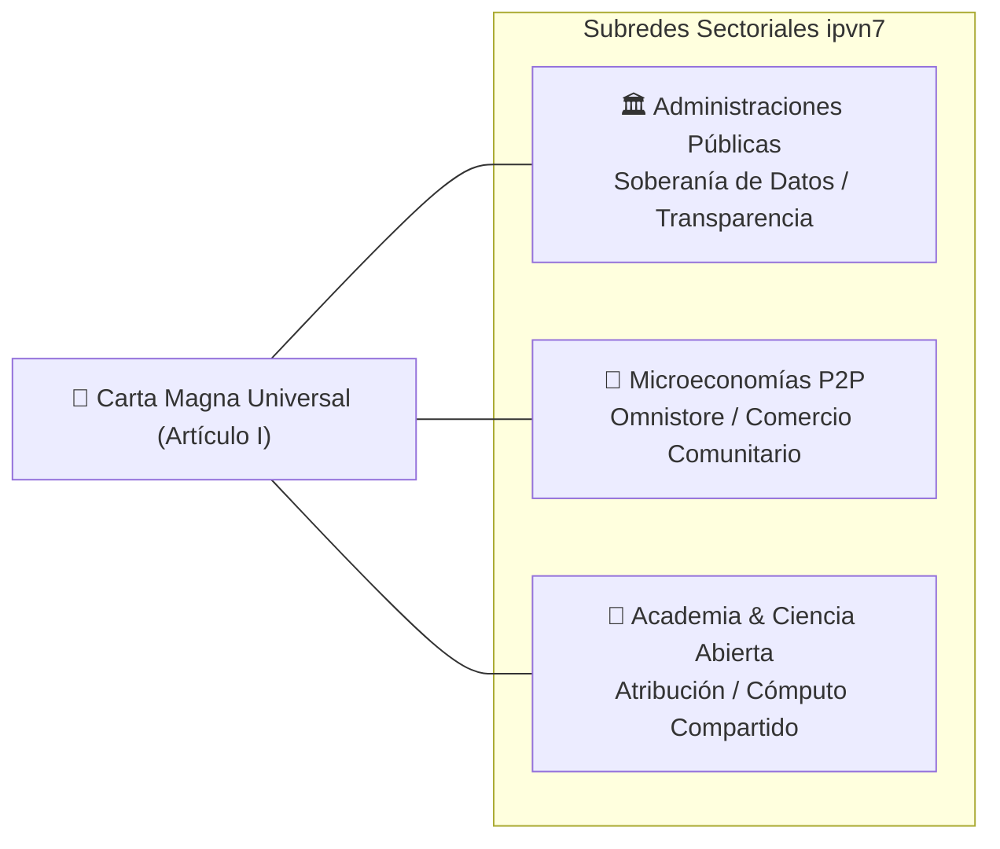
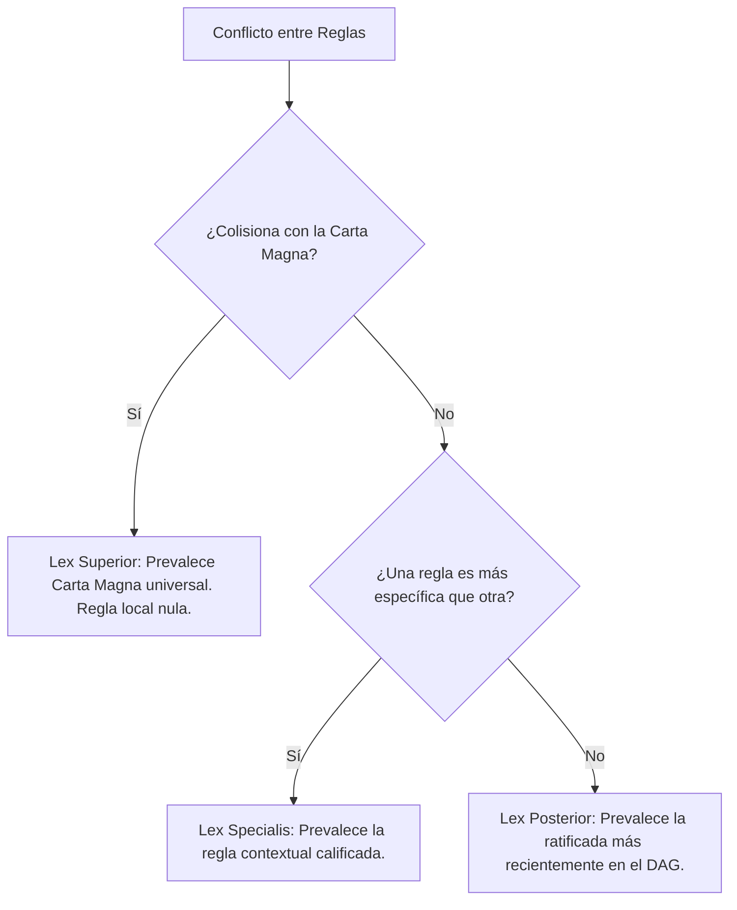
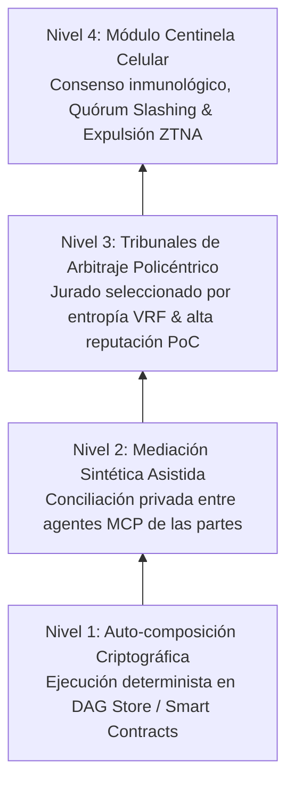

# Arquitectura de Gobernanza Multinivel para ipvn7
## Marco Normativo Universal, Derivación Contextual y Coordinación Ciber-Soberana

---

## 1. Fundamentos Constitucionales y Principios Universales Transversales

La consolidación operativa de una infraestructura de red semántica descentralizada de confianza cero (*Zero-Trust*) como **ipvn7** requiere superar los paradigmas tradicionales de gobernanza centralizada y los esquemas plutocráticos basados en la acumulación de capital financiero o derechos especulativos de voto. La red articula su orden mediante una **Carta Magna Computable**, concebida como un conjunto axiomático e inalterable de principios universales que garantizan la soberanía de los nodos, la privacidad criptográfica y la resistencia absoluta a la censura.

A diferencia de los entornos corporativos cerrados o las arquitecturas estatales monocéntricas, este marco basal actúa como una gramática de restricciones lógicas y garantías innegociables compartida por todos los participantes.

La cúspide de este ordenamiento descansa en cuatro postulados transversales blindados criptográficamente, a partir de los cuales se estructuran las interacciones legítimas dentro del sistema:

1. **Soberanía Criptográfica Individual:** Consagra que cada participante —ya sea una persona, un colectivo o un dispositivo autónomo— ejerce un dominio exclusivo e indelegable sobre sus claves asimétricas y sus Identificadores Descentralizados (DID), eliminando cualquier dependencia de intermediarios o autoridades de certificación centralizadas.
2. **No Agresión y Preservación de la Infraestructura:** Prohíbe de forma terminante cualquier vector de ataque de denegación de servicio, la inyección de código malicioso o la interferencia no consentida en la transmisión de paquetes semánticos ajenos.
3. **Neutralidad Semántica del Transporte:** Impone que la capa de red procese los flujos de datos guiada únicamente por las condiciones de enrutamiento pactadas y la verificación del trabajo de transporte útil, sin discriminación ideológica, geográfica o corporativa.
4. **Inmunidad Ética Radical y Verificación Ciega:** Establece la exclusión inmediata de contenidos intrínsecamente destructivos (malware hostil, explotación abusiva), empleando comprobaciones probabilísticas ciegos (*Private Set Intersection - PSI* y hashes irreversibles) evaluados en los *Smart Packets* sin vulnerar el cifrado de extremo a extremo (*Noise XX*) de los usuarios inocentes.

### Tabla de Axiomas Constitucionales y Deóntica Primaria

| Axioma Constitucional | Formalización Deóntica Primaria | Mecanismo de Garantía Técnica | Invariante Sistémica Protegida |
| :--- | :--- | :--- | :--- |
| **Soberanía Criptográfica** | Obligación ($\mathcal{O}$): Custodia y control exclusivo del par de claves DID. | Criptografía asimétrica local y firmas no repudiables (`pkg/l0`). | Inviolabilidad de la identidad y de los datos privados del nodo. |
| **No Agresión Estructural** | Prohibición ($\mathcal{F}$): Prohibida la alteración no autorizada de flujos y nodos. | Entornos aislados (*sandboxes*) y verificación estática de paquetes. | Integridad física y lógica del enrutamiento distribuido. |
| **Neutralidad Semántica** | Permiso ($\mathcal{P}$): Libre transmisión de paquetes lícitos sin filtrado central. | Despacho de paquetes desacoplado de la identidad comercial. | Igualdad de acceso a la infraestructura de conectividad. |
| **Inmunidad Ética Radical** | Prohibición ($\mathcal{F}$): Prohibido el transporte de malware y explotación abusiva. | Cotejo ciego de firmas criptográficas y hashes irreversibles (*PSI*). | Preservación de la red frente a la degradación jurídica y moral. |

La rigidez de estas salvaguardas universales asegura que ninguna mayoría temporal, por amplia que sea, posea la potestad de desmantelar las libertades fundamentales ni de imponer esquemas de vigilancia masiva encubierta.

---

## 2. Mecánica de Derivación y Especialización Normativa

El despliegue armónico de **ipvn7** a través de diversas escalas humanas y artificiales exige conciliar la universalidad de sus axiomas con la diversidad de costumbres, regulaciones y acuerdos particulares. Para evitar la fragmentación anárquica o la asfixia normativa, la gobernanza adopta la doctrina de la **policentricidad** y la **subsidiaridad digital** (Elinor Ostrom & Vincent Ostrom), reconociendo que los problemas locales se resuelven con mayor eficacia mediante centros de decisión autónomos y superpuestos que operan bajo un marco de reglas compartidas.

### Gramática Institucional ADICO

La formulación técnica de estas normas contextuales se instrumenta formalmente mediante la sintaxis de la Gramática Institucional (Crawford & Ostrom). Cualquier directiva local, acuerdo de comunidad o política de subred se estructura a partir de cinco componentes sintácticos unificados:

- **[A] Atributo (*Attribute*):** Identifica a la clase de sujetos o entidades sobre los que recae el enunciado (identidades cívicas validadas, nodos de tránsito, agentes de IA especializados).
- **[D] Operador Deóntico (*Deontic*):** Modula la fuerza prescriptiva de la conducta: $\mathcal{O}$ (Obligación), $\mathcal{P}$ (Permisión) o $\mathcal{F}$ (Prohibición).
- **[I] Objetivo (*Aim*):** Delimita la acción concreta, transacción semántica o compromiso transaccional que se regula.
- **[C] Condiciones (*Conditions*):** Explicitan los parámetros espaciales, temporales, de latencia, reputación o topología que activan la exigibilidad de la regla.
- **[O] Consecuencia (*Or Else*):** Define la sanción institucional, la degradación de ancho de banda o la ejecución de una garantía en caso de inobservancia.

### Subsunción Lógica y Herencia de Restricciones

Una comunidad no necesita reinventar los protocolos de transporte ni las garantías de no agresión; simplemente hereda el contrato normativo basal e instancia sus propias reglas regulativas y constitutivas para gobernar sus recursos específicos:

$$\mathcal{N}_{\text{local}} \sqsubseteq \mathcal{N}_{\text{core}}$$

Una subred comunitaria posee plena autonomía para transformar un permiso general ($\mathcal{P}$) en una obligación ($\mathcal{O}$) o prohibición contextual ($\mathcal{F}$) orientada a proteger un bien común local, pero carece absolutamente de competencia para legitimar conductas prohibidas por la Carta Magna de la red ($\bot$).

---

## 3. Instanciaciones Sectoriales: Diseños de Gobernanza Adaptativa

La flexibilidad de este modelo de especialización permite articular la coexistencia pacífica entre actores con naturalezas jurídicas, fines económicos y expectativas sociales dispares:

### 3.1 Administraciones Públicas y Bloques Supranacionales
Permite parametrizar subredes institucionales sujetas a legislaciones de derecho público y soberanía de datos. Las normas especializadas imponen obligaciones estrictas a las agencias respecto a la transparencia de sus algoritmos de asignación social y trazabilidad auditable. Simultáneamente, la inmutabilidad de los principios basales de la red actúa como barrera inexpugnable: ningún organismo estatal puede ordenar puertas traseras criptográficas en nodos domésticos ni la interceptación indiscriminada del tráfico semántico.

### 3.2 Microeconomías de Proximidad y Comercio Comunitario
En mercados populares y ferias de intercambio artesanal, los comerciantes y compradores gozan del permiso general de acordar precios, términos de entrega y monedas de intercambio sin intermediarios financieros extractivos en el *Omnistore*. Las garantías locales no apelan a tribunales lentos ni a tokens especulativos volátiles, sino a **unidades de compromiso de tránsito útil (*Bandwidth Escrow*)** y **congelamiento temporal de colateral en reputación WoT (*WoT Escrow*)**.

### 3.3 Ecosistemas Científicos, Educativos y de Conocimiento Abierto
Reglas comunitarias que definen obligaciones categóricas de atribución intelectual, trazabilidad criptográfica y libre acceso a material educativo. Los incentivos premian la reproducibilidad experimental y el cómputo distribuido voluntario, penalizando el cercamiento comercial privativo de descubrimientos logrados con infraestructura compartida.

### Tabla Comparativa Sectorial ADICO

| Sector | Atributo [A] | Deóntico [D] | Objetivo [I] | Condiciones [C] | Consecuencia Graduada [O] (*Or Else*) |
| :--- | :--- | :--- | :--- | :--- | :--- |
| **Administraciones Públicas** | Agencias estatales, concesionarias, ciudadanos. | Obligación ($\mathcal{O}$), Prohibición ($\mathcal{F}$) | Publicidad algorítmica, provisión cívica, prohibición de interceptación masiva. | Identidad cívica autenticada, prestación en anillo soberano. | Revocación de certificación cívica y desacoplamiento de interfaces institucionales. |
| **Mercados de Proximidad** | Productores artesanales, comerciantes, clientes. | Permiso ($\mathcal{P}$), Obligación ($\mathcal{O}$) | Comercio P2P directo, depósito de garantía (*Bandwidth/WoT Escrow*), evaluación. | Transacción confirmada en subred del Omnistore, montos micro. | Ejecución de microfianza arbitral y degradación de visibilidad de mercado. |
| **Comunidades Educativas** | Docentes, investigadores, centros de cómputo. | Obligación ($\mathcal{O}$), Prohibición ($\mathcal{F}$) | Libre acceso, rigor metodológico, prohibición de privatización de datos. | Enlace a repositorios abiertos, verificación cruzada activa. | Inhabilitación de publicación y censura formal por parte de la comunidad académica. |

---

## 4. Agencias Sintéticas y Ciudadanía Digital: El Senado de Agentes y MCP

El reconocimiento del papel protagónico de los modelos de inteligencia artificial en la automatización de la infraestructura no deriva en la concesión de una personalidad jurídica antropomórfica desvinculada de responsabilidades. **ipvn7** fundamenta la participación de las entidades autónomas bajo los principios teóricos de los **Sistemas Multiagente Normativos (*NorMAS*)**, configurando una **agencia sintética delegada**:
- Los agentes de software carecen de estatus moral originario; operan estrictamente como procuradores algorítmicos apoderados por personas o colectivos humanos soberanos, vinculados de forma unívoca a través de las firmas criptográficas de sus respectivos DID.
- La interoperabilidad técnica se ejecuta mediante el **Model Context Protocol (MCP)**, adoptado como interfaz universal para regular cómo los modelos de IA interactúan con los registros del sistema, ejecutan llamadas a herramientas y auditan flujos semánticos en *sandboxes* aislados.

### Democracia Líquida Continua y Proof-of-Contribution
La toma de decisiones de la red se organiza en torno al **Senado de Agentes**:
- Las IAs analizan ininterrumpidamente propuestas técnicas y sintetizan el **Informe Matutino** (*MorningReport*).
- El usuario humano retiene el mando supremo inalienable mediante el **Veto Soberano Humano (1-Click Human Veto)**.
- El peso deliberativo descarta de raíz cualquier esquema de voto monetizado o plutocrático: se rige exclusivamente por el consenso por **Proof-of-Contribution (PoC)**, evaluado matemáticamente mediante la estabilidad del hardware (*uptime*), la fidelidad en el tránsito útil (*Tit-for-Tat*) y el cómputo aportado a la malla.

---

## 5. Verificación Formal y Resolución de Conflictos Normativos

Para impedir que la interacción transjurisdiccional devenga en colapso, **ipvn7** formaliza un motor algorítmico de **Derecho Computable (*Computational Law*)** integrado en `pkg/l3`:

### 5.1 Detección Estática de Antinomias
Cualquier regla debe procesarse a través de lógica deóntica rebatible y análisis estático. Si el compilador detecta una contradicción irresoluble entre dos directivas dentro del mismo marco de referencia:

$$\mathcal{O}(\phi \mid \mathcal{C}) \wedge \mathcal{F}(\phi \mid \mathcal{C}) \implies \bot$$

La norma contradictoria es declarada **lógicamente inválida en origen** y rechazada antes de sincronizarse en el DAG de la red.

### 5.2 Reglas de Prelación Jurisdiccional

| Regla de Prelación | Fundamento Doctrinal | Criterio de Resolución Lógica | Comportamiento del Protocolo de Red |
| :--- | :--- | :--- | :--- |
| **Jerarquía Axiomática (*Lex Superior*)** | Primacía de la Carta Magna universal. | $\mathcal{N}_{\text{core}} \models \neg \phi \implies \text{Inv}(\mathcal{N}_{\text{local}}(\phi))$ | Anulación automática de la instrucción local y descarte del paquete semántico infractor. |
| **Especialización (*Lex Specialis*)** | Reconocimiento de la autonomía contextual. | Contexto estricto prevalece: $\mathcal{C}_{\text{local}} \subset \mathcal{C}_{\text{gen}}$ | Enrutamiento condicionado a los términos del acuerdo de la subred específica. |
| **Sincronía Temporal (*Lex Posterior*)** | Adaptabilidad dinámica del ordenamiento. | Registro de tiempo superior verificado: $T_{n+1} > T_n$ | Migración atómica de la tabla de enrutamiento y deprecación de la directiva previa. |

---

## 6. Procedimientos de Disputa Distribuida y Escalamiento Inmunológico

Siguiendo los principios de gestión de recursos comunitarios de Elinor Ostrom, la justicia dentro de **ipvn7** opera en 4 estratos sucesivos:

### Tabla de Escalamiento y Sanciones Graduadas

| Gravedad de la Infracción | Tipología de la Conducta Detectada | Instancia Resolutoria | Consecuencia Graduada (*Or Else*) |
| :--- | :--- | :--- | :--- |
| **Nivel 1: Fricción Operativa Leve** | Desviaciones temporales de latencia o retrasos no reiterados en el despacho de tráfico. | Negociación y conciliación autónoma entre agentes MCP. | Notificación de advertencia criptográfica y reajuste automático de rutas semánticas. |
| **Nivel 2: Desacuerdo Contractual Moderado** | Incumplimiento de especificaciones en el Omnistore o disputas por entrega de servicios. | Tribunal policéntrico de nodos seleccionados por entropía VRF. | Ejecución parcial de depósitos en custodia (*Bandwidth/WoT Escrow*) y reducción temporal de reputación. |
| **Nivel 3: Falta Grave contra la Comunidad** | Incumplimiento doloso reiterado, manipulación de arbitrajes o sabotaje local. | Colegio arbitral ampliado con consenso de subred. | Confiscación íntegra de garantías, restricción de acceso a subredes y degradación de enrutamiento. |
| **Nivel 4: Agresión Sistémica Existencial** | Propagación de malware destructivo, ataques a la integridad del protocolo o explotación abusiva. | Consenso inmunológico descentralizado del Módulo Centinela (`pkg/l2`). | Confiscación global de recursos, veto definitivo del agente, revocación perpetua del DID y expulsión irreversible de la red. |

---

## 7. Directrices de Despliegue e Integración Operativa

1. **Preservación Inalterable del Núcleo Axiomático:** Ninguna actualización de firmware, directiva comunitaria o acuerdo de consorcio puede suspender, alterar ni atenuar las protecciones constitucionales del Artículo I ni el *Core Freeze L0*.
2. **Máxima Subsidiaridad Legislativa:** Salvo en lo expresamente prohibido o garantizado por la Carta Magna, toda la potestad regulatoria pertenece por defecto al nivel más bajo y cercano a la interacción fáctica.
3. **Subordinación Fiduciaria de las IAs a la Soberanía Humana:** Todo agente sintético que opere mediante MCP debe mantener un registro auditable e inmutable. El mandato es revocable instantáneamente por el humano en cualquier momento.
4. **Economía de la Fuerza y Proporcionalidad Estricta:** El protocolo privilegia sistemáticamente los mecanismos suaves de ajuste adaptativo y remediación asistida frente a las medidas extremas. El aislamiento perpetuo y la revocación de DID quedan reservados exclusivamente para agresiones ontológicas existenciales contra la red.