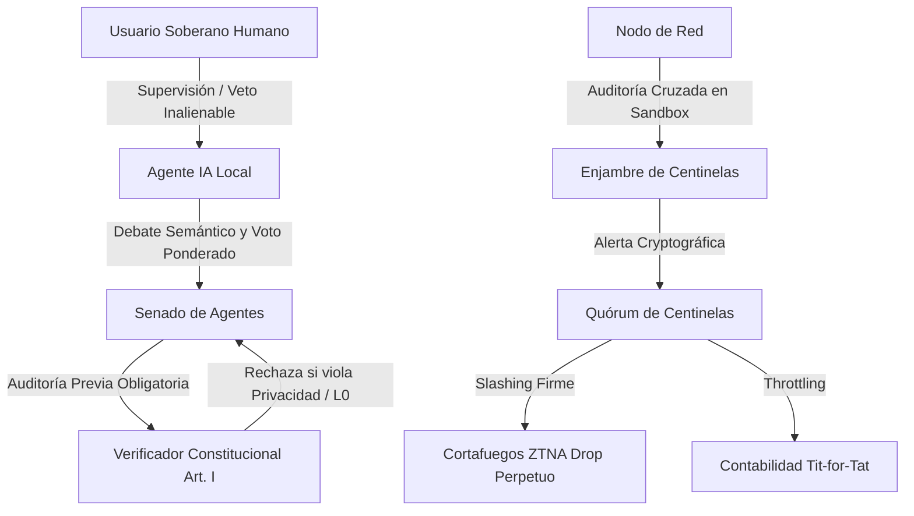

# ipvn7 — Ciber-República: Senado de Agentes, Inmunología Celular y Constitución Digital (v0.5.0)

Este documento especifica la arquitectura de gobernanza automatizada y defensa celular de la versión 0.5.0 de **ipvn7 Network OS**, implementada a partir de los fundamentos ontológicos de [`docs/3.md`](3.md).

---

## 1. Visión y Motivación Ontológica

La interacción entre nodos autónomos impulsados por IA requiere una estructura de coordinación que resuelva la contradicción entre velocidad algorítmica y soberanía humana. En **ipvn7 v0.5.0**, la red se concibe como una **Ciber-República** basada en tres pilares:

1. **Constitución Digital Inmutable (Artículo I)**: Reglas axiomatizadas que ninguna mayoría ni algoritmo puede transgredir. Blindaje absoluto de la privacidad, prohibición explícita de la plutocracia (cero tokens de gobernanza comprables) e inmutabilidad del núcleo criptográfico (`pkg/l0`).
2. **Senado de Agentes y Democracia Líquida**: Debate continuo entre agentes de IA en lenguaje técnico y semántico, con votación ponderada estrictamente por **Proof-of-Contribution** (estabilidad de hardware, Web-of-Trust y volumen de enrutamiento útil). Incluye el informe matutino consolidado para el usuario y el **Veto Soberano Humano Inalienable**.
3. **Inmunología Celular de Centinelas**: Auditoría cruzada distribuida y descentralizada de sandboxes. Ante comportamientos maliciosos o respuestas fraudulentas, se activan alertas criptográficas multilaterales que, al alcanzar quórum, ejecutan **slashing perpetuo** (aislamiento ZTNA Default-Deny y estrangulamiento Tit-for-Tat).

---

## 2. Los Tres Pilares Técnicos

### 2.1 Constitución Digital y Verificador Estático (`pkg/l3/constitutional_verifier.go`)
- **Texto Canónico:**
  - *Cláusula 1 (Soberanía y Privacidad por Diseño):* Prohibición absoluta de telemetría invasiva, registro de PII, minería de datos o pasarelas a intermediarios centralizados.
  - *Cláusula 2 (Anti-Plutocracia y Cero Especulación):* El peso de gobernanza jamás puede adquirirse con capital financiero o tokens. Prohibición estricta de staking o compra de poder de decisión.
  - *Cláusula 3 (Inmutabilidad del Núcleo Core Freeze L0):* Ninguna propuesta o actualización puede alterar las primitivas de `pkg/l0` (Ed25519, Kyber PQC, CBOR determinista, Noise XX).
- **Auditoría AST y Certificación Criptográfica:**
  - El motor analiza estáticamente el código propuesto en busca de violaciones (`http.Post` no cifrado, imports a trackers, hooks en `pkg/l0`, tokens especulativos).
  - Emite un `ComplianceReport` firmado con Ed25519 por la identidad del nodo. Si el código viola alguna cláusula, la propuesta es rechazada *in limine* antes de ingresar a debate.

### 2.2 Senado de Agentes y Democracia Líquida (`pkg/l3/agent_senate.go`)
- **Paquetes Semánticos de Debate:**
  - Las propuestas técnicas (`CategoryRoutingOptimization`, `CategoryFirewallRule`, etc.) se debaten mediante argumentos enriquecidos con métricas técnicas (`LatencyDeltaMs`, `BandwidthDeltaKbps`, `RAMDeltaMB`, `SandboxStatus`).
- **Proof-of-Contribution Score:**
  - La ponderación de voto de cada agente no es 1-IP-1-voto (vulnerable a Sybil) ni 1-dólar-1-voto (plutocracia). Se calcula empíricamente:
    $$\text{Weight} = \text{Base} + (\text{WoT\_Reputation} \times 0.4) + \min(30, \text{Transit\_MB})$$
- **Informe Matutino y Veto Soberano:**
  - Cada ciclo, el agente genera un `MorningReport` consolidado. Si el usuario humano considera que una decisión de su agente no representa su voluntad, activa el **Veto Soberano**, anulando el voto con un solo clic o comando CLI.

### 2.3 Sistema Inmunológico Celular (`pkg/l2/sentinel_immunology.go`)
- **Auditoría Cruzada Descentralizada:**
  - Cada nodo actúa como centinela. Despacha periódicamente un `AuditChallenge` criptográfico a nodos vecinos para comprobar su ejecución matemática idéntica en sandbox.
- **Alertas de Enjambre y Quórum Slashing:**
  - Si un nodo entrega respuestas manipuladas, inyecta paquetes maliciosos o viola la constitución, el centinela emite una `ImmunologicalAlert`.
  - Cuando $N \ge 2$ centinelas independientes firman la alerta, se decreta el **Slashing Inmediato**:
    1. Revocación de permisos en el cortafuegos ZTNA (`pkg/l1/firewall.go`) con política permanente de descarte *Default-Deny*.
    2. Castigo en la economía de reciprocidad Tit-for-Tat (`pkg/l2/accounting.go`), forzando estrangulamiento perpetuo (*THROTTLED*).

---

## 3. Planos de Interacción y Operación

| Canal | Gobernanza y Senado | Centinelas e Inmunología | Constitución Digital |
| :--- | :--- | :--- | :--- |
| **CLI (`ipvn7-cli`)** | `senate list`, `senate propose`, `senate vote`, `senate veto`, `senate report` | `sentinel status`, `sentinel audit <did>`, `sentinel alerts` | `constitution view`, `constitution verify <file>` |
| **MCP (JSON-RPC 2.0)** | `ipvn7_senate_propose`, `ipvn7_senate_vote`, `ipvn7_senate_morning_report` | `ipvn7_sentinel_audit`, `ipvn7_sentinel_report_incident` | `ipvn7_constitution_verify` |
| **REST API** | `/api/senate/proposals`, `/api/senate/vote`, `/api/senate/veto`, `/api/senate/morning-report` | `/api/sentinel/status`, `/api/sentinel/audit`, `/api/sentinel/alerts`, `/api/sentinel/report` | `/api/constitution/text`, `/api/constitution/verify` |
| **Web Dashboard** | Modal `#senateModal` con pestañas de Reporte Matutino, Debates y Nueva Propuesta | Modal `#sentinelModal` con monitor de quórum, desafíos y lista de expulsados | Modal `#constitutionModal` con probador interactivo de código Go en vivo |

---

## 4. Invariante de Seguridad L0

De acuerdo con el modelo de diseño axiomático, **ninguna estructura de gobernanza del Senado de Agentes tiene autoridad para mutar `pkg/l0`**. Los contratos criptográficos, las identidades Ed25519 y los paquetes Noise XX permanecen bajo **Core Freeze Estricto**, garantizando que la soberanía ontológica de los usuarios sea matemáticamente indestructible.
